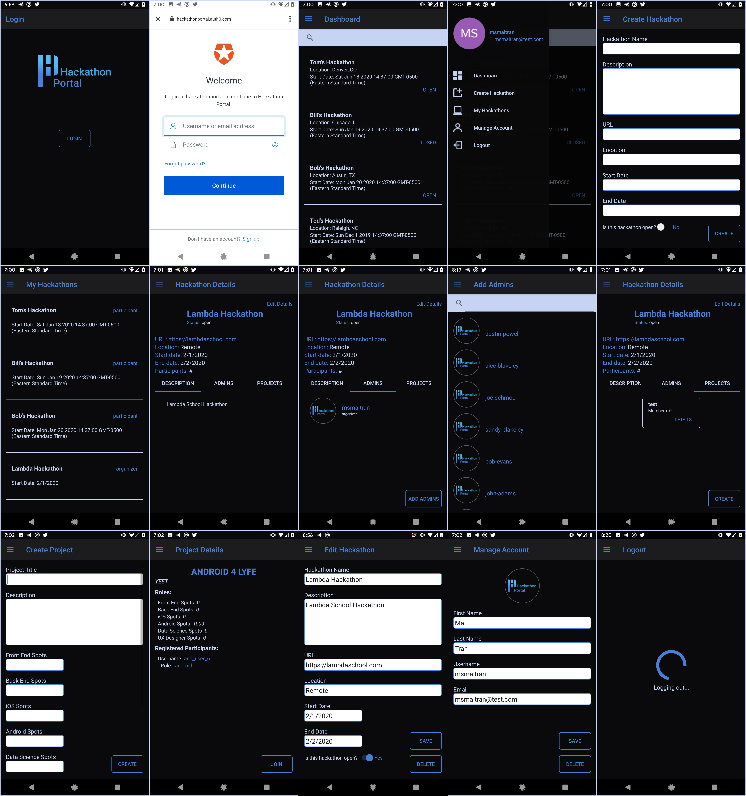

Android Developer

## Welcome to My Portfolio

### Contact
tjamesclawson@gmail.com

[LinkedIn](https://www.linkedin.com/in/tyler-clawson-54a881160/)

[Github](https://github.com/tjclawson)

### Projects
#### Hackathon Portal
A one stop shop for running hackathons
##### Features
- Organizers create, update, and remove hackathons
- Organizers can review and accept project submissions
- Users can search and register for hackathons
- Users can view hackathon projects and sign up for hackathon teams

[GitHub Repository](https://github.com/Lambda-School-Labs/hackathon-portal-android)

#### Receipt Tracker
Convenient app to allow users to track their receipts
##### Features
- Allow users to create, update, and delete receipts
- Users can upload photo of appropriate reciept
- Users can search for receipts based on amount, category, vendor, or date
- Users can view chart of spending over date range

[GitHub Repository](https://github.com/Build-Week-ReceiptTracker/Android)

.png)
